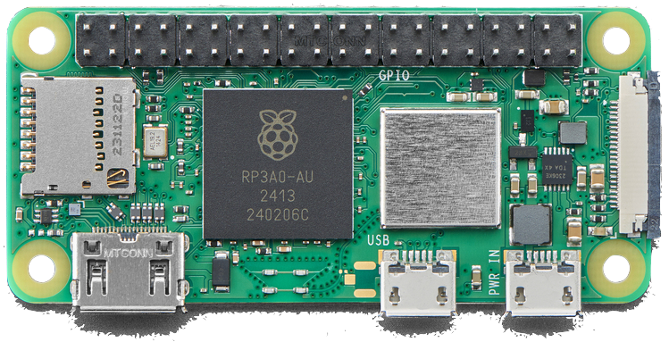
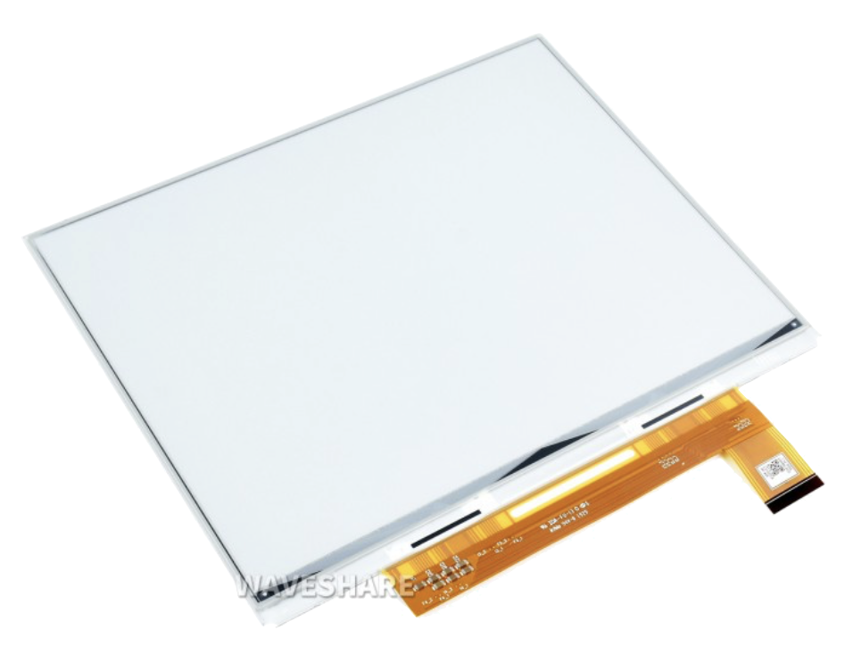
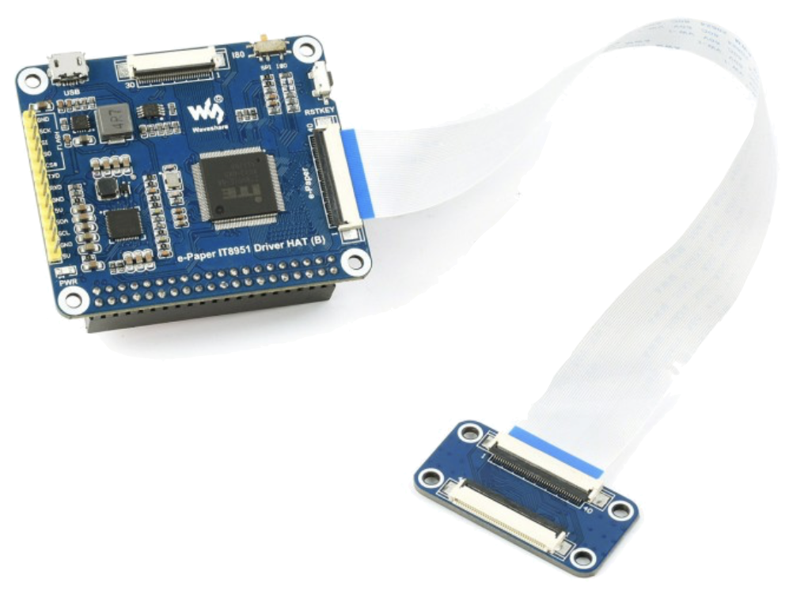
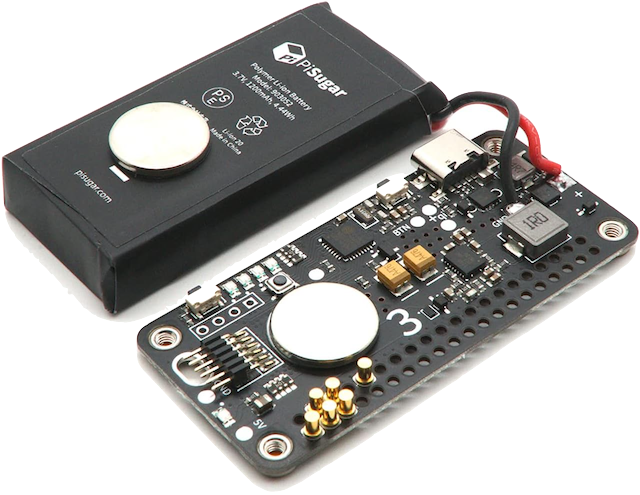
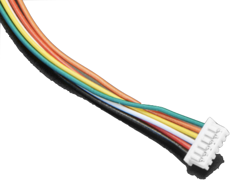
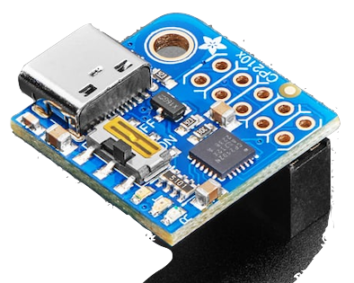
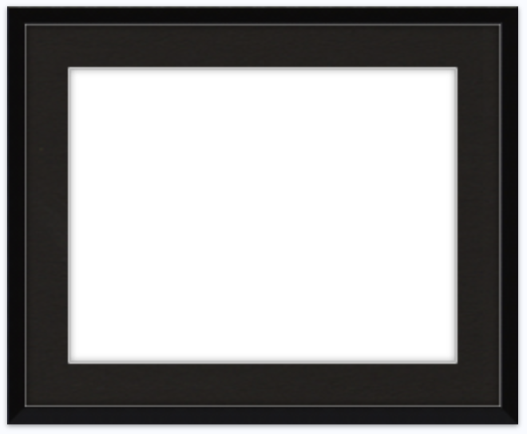
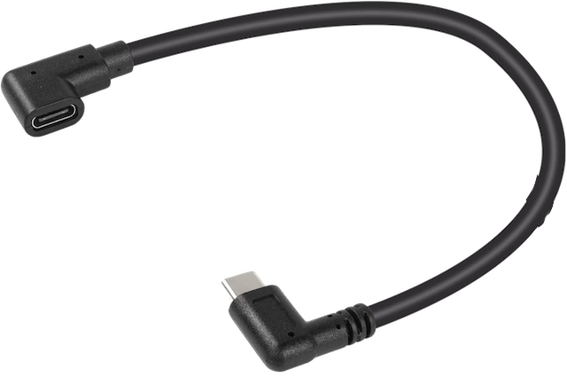
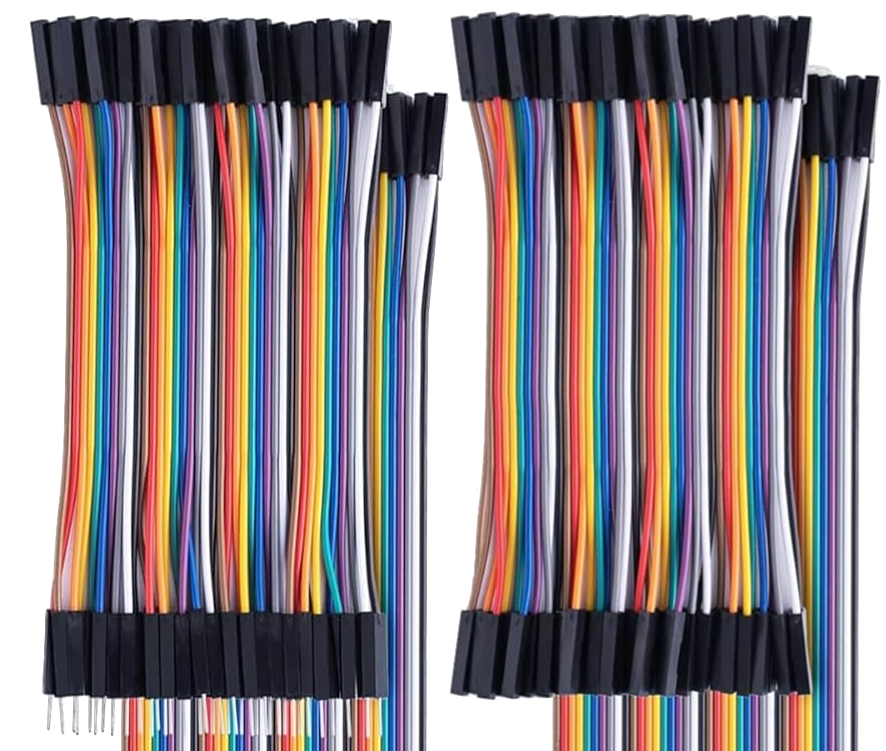

# Fancy e-ink photo frame

### A project to build a nice 10.3-inch grayscale e-paper picture frame that updates once a day.

For years I've been intrigued by the unique aesthetics of e-paper displays.  A changeable surface that doesn't emit any light, and can display a static image without power?  Wouldn't this be great for showing art?

I'm a pretty decent programmer, but when it comes to hardware I'm a novice.  I own a soldering iron but I'm lousy at soldering.  This project went through a few iterations where I tried soldering wires directly onto things and the result was lumpy wires and burned spots on the components.  Eventually I hit on a design that didn't use any soldering at all, just some joining of wires with a crimping tool.  My squinty eyeballs and toasted fingers were grateful.

The software is in better shape.  Driving the e-paper display directly from Python on a Raspberry Pi is complicated, so I went with a sneaky approach:  I modified the freeware demo code published by the display manufacturer.  It's written in C, and all my version does is load an image from storage and send it to the display.

All the rest of the code is in Python, and I designed it to do the following:

* When the Raspberry Pi powers up, it checks to see if it's on battery power, or is charging from the USB-C cable.
* It picks one out of the 50% least-recently displayed images from a database on disk.
* It converts the image to Bitmap (BMP) format.
* It calls the C program to display the image, also passing along the current charge percentage of the battery, which is overlaid onto the image.
* If it's on battery power, it sets the PiSugar 3 "wake up" timer to a configured interval, makes sure the wifi driver is off, then powers everything back down.
* If it's charging, it turns on the wifi chip, so the device joins any nearby wifi networks it's already aware of.  Then it goes idle, staying on until someone manually shuts it down (or unplugs the cable and re-runs the Python script)

The history of what image was displayed, and when, and the battery state at the time, is written into the database.

Since I'm using the C program to drive the display, there is no Python display driver.  I'm also driving the PiSugar 3 directly with bus commands, so there's no need to use the PiSugar 3 driver or interface service either.

There are two support scripts included as well:

* `png_inventory.py` scans through a collection of image folders for PNG files, and adds any that are new to the database.
* `register_service.py` can be used to register the script to be automatically launched when the Raspberry Pi is powered up, and to unregister it if necessary 

### Future plans:

There are two additional things I might add here, depending on the direction I want to go:

* Add a web server on the device that launches when it's charging, and can be used to manage the database of images, including uploading new ones and scheduling an image playlist.
* Add a process that runs when wifi is connected, fetching a set of new images and/or an image playlist from a predefined web location.

For now, I just have over a thousand images dumped directly onto the microSD card.  It'll take three years or so to run through them, so there's no hurry to decide which of the above approaches to take...

# Parts list:

### [Raspberry Pi Zero 2WH](https://www.adafruit.com/product/6008)
* Wifi, bluetooth, micro-SD slot
* GPIO header pins included
* Relatively flat shape (for going behind a frame!)

### [10.3-inch e-Ink display](https://www.waveshare.com/10.3inch-e-Paper-HAT.htm)
* 1872x1404
* 16 shades of grayscale
* 1 second refresh time (but could be a whole minute for all I care)
* Just the raw display.  Careful!  Very fragile without an enclosure!

### [Waveshare e-Ink display Hat](https://www.waveshare.com/10.3inch-e-Paper-HAT.htm)
* Included with the display
* Several ways to wire it to a Raspberry Pi

### [PiSugar 3 portable power supply](https://www.pisugar.com)
* 3.7v 1200mah battery
* Internal clock
* Low-power mode with a wake up alarm to turn on the Raspberry Pi
* USB-C charging

### [6-pin Molex Connector Cable, 1.25mm pitch](https://www.adafruit.com/product/4926)
* Wires included
* This fits the aux connector on the PiSugar 3

### [PiUART - USB Console and Power Add-on](https://www.adafruit.com/product/3589)
* For diagnostics when wifi is unavailable
* Cheap
* Handy in an emergency

### [Custom size empty frame from Frame-It-Easy](https://www.frameiteasy.com/frame-styles/ashford?cid=1)
* Art Size: 8 3/4" x 6 3/4"
* Outside Frame Size: 10 15/16" x 8 15/16"
* Style: Ashford, in Gloss Black
* Matting: 1" Smooth Black (White Core)
* Cover: Clear Acrylic

### [Right-angle USB-C extension cord](https://www.amazon.com/dp/B0BZBRG92Z)
* 0.3 meters
* Makes it much easier to charge the battery

### [A heap of wire caps and a crimping tool](https://www.amazon.com/dp/B0CYNYJTKD)
* No soldering in this project
* Way more than I need, but oh well

### [A pile of short breadboard jumper wires](https://www.amazon.com/dp/B0CNXLLNGN?th=1)
* No soldering needed
* Way too many for this project, but I guess I have spares now

## You will also need:

* Some tape
* An x-acto knife or similar very sharp thing
* A slotted screwdriver
* __A Dremel tool or other means of grinding down metallic material!__

As the instructions below will show, the display board that comes with the e-ink display has a giant connector and pins on it that you don't need, but that add a lot of thickness.  To make the component fit nearly behind the frame you're going to need to _grind these things down to stumps!_  It is satisfyingly violent.

You can skip that step if you want, but you'll need a thicker frame, or it won't hang flat on a wall.  That might not bother you either, though, if you plan to prop the frame on a desk or nightstand.

# Hardware setup

WIP
